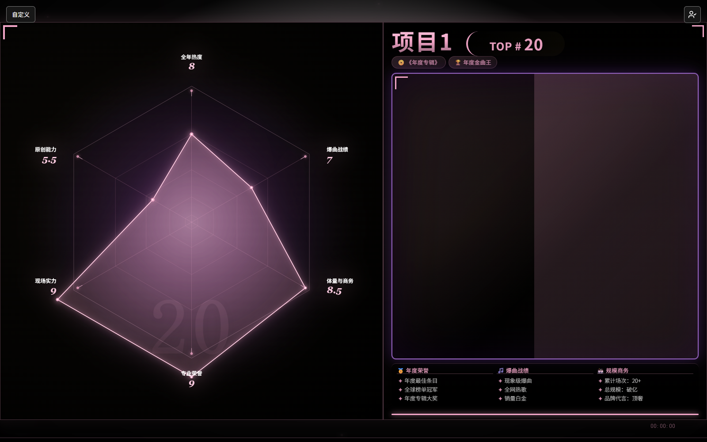
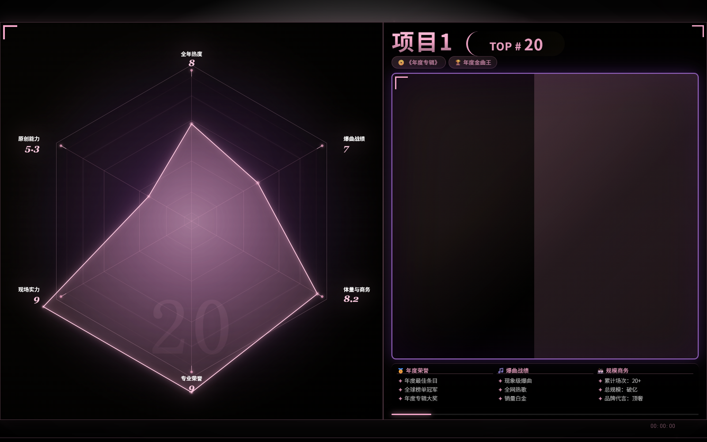

# Radar Chart TOP20 Template

[简体中文](README.md) · **English**

A **single-file, dependency-free, offline-capable** visualization template for multi-criteria rankings. Compare 20 entries across 6 dimensions on a radar chart, with sequential playback, inline score editing, editable achievement text, and automatic BEST transitions.

Just open `index.html` — no build step, no server, no network requests.



## 📖 Documentation

| Document | For | Contents |
|---|---|---|
| **[GUIDE.md](GUIDE.md)** | 🤖 **Non-programmers** | Hand-it-to-an-AI guide (Chinese) — how to phrase requests, image setup, FAQ |
| **[TUTORIAL.md](TUTORIAL.md)** | 💻 **Developers** | Architecture, ranking algorithm, image pipeline, debugging, pitfalls (Chinese) |
| **[ABOUT.en.md](ABOUT.en.md)** | 📋 **Quick overview** | What it is, what it's for, design trade-offs |

> Chinese documentation is more detailed. This README covers everything you need to run and customize the template.

## Features

### 🎯 Automatic BEST computation (including ties)

No manual flagging. On load, the template scans every entry and **automatically marks whichever entry holds the highest score in any dimension** as BEST, triggering a dedicated transition animation.

- **Ties are all marked** — if two entries share the top score in a dimension, both get BEST. No arbitrary tie-breaking.
- **Follows your edits** — change a score in the UI and BEST recomputes immediately, no reload needed.
- **Zero-columns are ignored** — if every entry scores 0 in a dimension, nobody is marked BEST.

### 📐 Self-adapting radar scaling and repositioning

**Every entry's radar chart is sized and positioned independently, in real time.** Different score distributions produce different shapes, so the scale factor and centering offset differ per entry — the polygon never clips the frame or shrinks into a corner.

The algorithm is "find the largest feasible scale, then center":

1. Walk all 6 dimensions and compute the **full bounding box** of the data polygon plus its outer text labels.
2. **Binary search (28 iterations)** for the largest scale that fits the bounding box inside the canvas (with a 96px safety margin).
3. Derive an offset from the bounding box center to **translate the chart into the middle**.
4. Interpolate with a quintic ease — switching entries or editing scores animates **both scale and position smoothly**, never snapping.

So when you change one dimension's score, you'll see the radar chart **deform while simultaneously resizing and repositioning itself**.

### 📊 Ranking and display use separate scales

Ranking is driven solely by an **integer-weighted score** (multiply by 100, round, then accumulate). This eliminates float-precision misrankings — the kind of "mathematically equal but the program disagrees" bug that's notoriously hard to track down.

The *displayed* total uses a separate three-segment linear mapping that stretches the slope above 8.5 to give the top end more overflow. **That mapping never participates in ranking**, so you can tune the visuals freely without accidentally changing placements.

### 🖼️ Image pipeline (stays smooth at scale)

- One-time dataURL → `blob:` URL conversion, so switching doesn't re-decode multi-MB base64 on the main thread
- `img.decode()` pre-decoding, so swapping `src` costs almost nothing
- LRU cache keeping only the 6 most recent decoded bitmaps, preventing memory bloat
- `requestIdleCallback` progressive prefetching, so startup never blocks the main thread
- Transition-token guards: switching mid-transition discards stale async results instead of rendering the wrong image

### 🎬 Presentation mode (for recording / screen sharing)

Hides every management entry point with one keystroke, leaving only the clean ranking view:

- Hides the **customize button**, the **photo manager button**, both floating panels, and the "click to edit" hint
- **The ranking itself is completely unaffected** — radar chart, animations, keyboard controls, timeline, and BEST transitions all keep working
- Timeline and session timer stay visible (they're part of the ranking view)

How to enable:

| Method | Action |
|---|---|
| Shortcut | `Ctrl + Shift + P` to toggle (choice is remembered) |
| URL parameter | Append `?present=1` or `#present` (handy for a recording shortcut) |
| Force off | Append `?present=0` |



> The screenshot above is in presentation mode — note the "自定义" button (top-left) and 📷 button (top-right) are gone.

### Everything else

| Feature | Notes |
|---|---|
| **Single file** | HTML + CSS + JS in one file. Double-click to run. |
| **Zero dependencies** | No framework, no CDN, no external requests. Works fully offline. |
| **Automatic theme colors** | Assigned by order, so adjacent entries are always distinguishable. |
| **Single source of truth** | Dimension list, radar labels, and score panel all generate from one config. |
| **Editable data** | Scores and achievement text editable in-page, persisted to localStorage. |
| **Photo setup** | Bulk-load a local folder (matched by filename), or upload/crop individually. |
| **Tie display** | Equal scores share a placement using standard competition ranking (1, 2, 2, 4). |
| **Global timeline** | Draggable progress bar; navigate with `←` `→`. |
| **Keyboard-first** | `Ctrl+E` score panel, `Space` pause, `Enter` commit, `Esc` cancel. |
| **Honest storage errors** | If photos can't be saved, you're told explicitly — it never fakes success. |

## Quick start

```
Open index.html directly in a browser.
```

Or serve it statically:

```bash
python -m http.server 8000
# then open http://localhost:8000
```

## Customizing

Everything you need to change lives near the top of the file. Search for these keywords:

| To change | Search for | Notes |
|---|---|---|
| Entry names and scores | `singersRawOrder` | Add/remove rows freely. **Bump `DATA_VERSION` after editing.** |
| Dimension names | `dimNames` | Order must match `points`. |
| Dimension descriptions | `dimDescriptions` | Same order as `dimNames`. |
| Dimension weights | `rankingWeightPercent` | **Must sum to 100.** |
| Theme palette | `themePalette` | Colors are picked by rank order, so renames/reordering never misalign them. |
| Default achievement text | `achievementDefaults` | Indexed by position. |
| Reporting period | `rankingPeriod` | Shown on the rules screen. |
| Radar scale ceiling | `RADAR_MAX_SCORE` | Defaults to 10. |

### Data shape

```js
const singersRawOrder = [
    {
        name: "Item 1",                   // entry name (photo matching uses this)
        points: [8, 7, 8.5, 9, 9, 5.5],   // 6 dimensions, matching dimNames order
        honors: ["🏆 Achievement", "🎤 Achievement", "💿 Achievement"],
        duration: 10000                   // share of the global timeline (ms)
    },
    // ...
];
```

Adding or removing entries is safe — colors and default text are assigned by index and adapt automatically. Beyond 20 entries, the palette cycles.

> `points` must have the same length as `dimNames`, or scoring will produce `NaN`.

### ⚠️ The most common mistake

After editing the initial data in code, **you must also change `DATA_VERSION`** (search for it). The version check wipes user data when the version changes. If you don't bump it, scores cached in the user's browser will silently override your new data.

## Keyboard shortcuts

| Key | Action |
|---|---|
| `Ctrl + E` | Toggle the 6-dimension score editor |
| `Ctrl + Shift + P` | Toggle presentation mode |
| `←` / `→` | Previous / next entry |
| `Space` | Pause / resume |
| `Enter` | Commit edit |
| `Esc` | Cancel edit |

## Where data lives

All in browser localStorage. **Nothing is uploaded anywhere.**

| Key | Contents |
|---|---|
| `radarChart_points` | Per-entry scores |
| `radarChart_honors` | Per-entry achievement text |
| `radarChart_achievements` | Editable achievements |
| `radarChart_portraits` | Entry card photos |
| `radarChart_best_photos` | BEST transition photos |
| `radarChart_best_backgrounds` | BEST background images |
| `radarChart_templateCustom` | Custom title/subtitle |
| `radarChart_version` | Data version tag |

Use the in-app 「↺ 重置全部」 button to clear. **Photos must be re-configured after switching browsers or clearing cache** — only the mapping is stored, not the image files.

### About the storage limit

Browsers cap localStorage at roughly **5MB**, which 20 photos can easily exhaust. Two things are done about it:

1. **Cropped results are stored as JPEG (quality 0.92) rather than PNG** — a 720×720 image drops from ~800KB to ~90KB, so 20 of them total ~1.9MB and fit comfortably. (Use the "下载 PNG" button when you need a lossless export; that path is unaffected.)
2. **Failures are reported, never hidden** — if a write doesn't fit, the status line says so and shows actual usage plus what to do.

If you genuinely need many large images, use external image URLs or split across files — localStorage is not an image store.

## Browser support

Requires `requestIdleCallback` (recent Chrome / Edge / Safari / Firefox); a `setTimeout` fallback is included. Uses ES2020+ syntax (optional chaining, nullish coalescing) and Canvas 2D.

## Tests

The ranking and tie-breaking rules have a standalone test (pure logic, no browser required):

```bash
node test/rank.test.cjs
```

Covers: no ties, two-way and three-way ties, multiple tie groups, all-equal, single entry, and mid-table ties.

## Development

Built collaboratively by:

- **GPT-6.1 Sol**
- **DeepSeek V4.1 Flash**
- **GLM 5.3**

## License

MIT — see [LICENSE](LICENSE).
